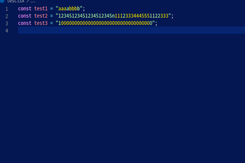

# repeated-characters README

This extension colorize characters each 3 characters.

## Preview

<p align="center">
  
</p>

## Settings

`ctrl + shift + p` = > Open Settings(JSON)

```jsonc
{ 
    ...

    "editor.tokenColorCustomizations": {
        "textMateRules": [
            {
                "scope": "keyword.rc-quoted",
                "settings": {
                    "foreground": "#ffd900"
                }
            }
        ]
    }
}
```

## LIMITATION

- 중복 조건을 서로 다르게 적용할 경우(e.g. 3, 5, 10) Syntax Highliting에서는 적용되지 않음.
- `constant.numeric.decimal`에서 `match`를 적용해도 실제로는 탐지해내지 못 함.
- 예를 들어 3개 중복 조건이 여러 번 중복되는 경우(e.g. 111111) 색을 서로 다르게 변경해줘야 하는데 `settings.json`에서는 dynamic value 혹은 calculating이 불가함.(`Math.random()`을 이용해 색을 랜덤으로 지정하거나 배열에서 순서대로 적용하는 방법이 존재)
- 특정 패턴이 반복 되는 경우 hard coding 하지 않고서는 syntax를 지정할 수 없음.

## NEXT

- Syntax Highliting이 아닌 Semantic highliting을 활용해 regex와 조건문을 활용하여 상기의 문제점이 해결되도록 해야 함.

## TODO

- LICENSE
- Semantic highliting